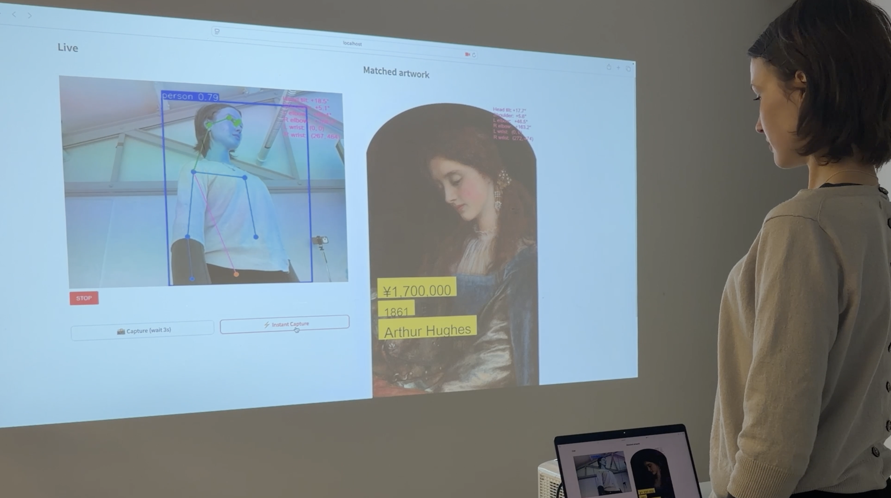

````markdown
# Embodied Aesthetic Reconstruction  
*Final MSc Project — University of the Arts London (CCI)*  

---

## 📖 Project Statement  
"**Embodied Aesthetic Reconstruction Against Disciplinary Norms**" is a research project on a personalised artistic image-generation system based on motion capture and generative AI, creating playful and artistic outputs that correspond to each individual’s body shape.

The project aims to challenge the body anxiety produced by standardised and homogenised ideals of the “perfect body.” By using motion-capture technology to scan each person’s physical form, and an AI-driven artwork database to automatically match suitable portraits or fashion silhouettes, the system highlights that every individual possesses their own complete aesthetic presence and value. What is considered perfect — a beautiful body — should inherently be diverse and unique.

---

## 1. System Overview  
This MVP implements a fully functional real-time pose-driven curatorial AI system combining:

- YOLOv8-Pose for live keypoint detection  
- OpenCLIP (ViT-B/32) for visual embeddings  
- Hybrid similarity scoring (CLIP + Pose fusion)  
- Curated multi-museum portrait dataset  
- Streamlit frontend + FastAPI backend  
- Stillness-triggered auto-capture (3–5 seconds)  
- Real-time artwork display with metadata (artist / year / value)  

**Pipeline:**  
Camera → Pose Estimation → Embedding Fusion → Artwork Matching → Curated Output

---

## 2. Repository Structure

```text
EmbodiedAestheticReconstruction/
│
├── backend/                     # FastAPI backend engine
│   ├── main.py                  # API entrypoint
│   ├── config.py
│   ├── utils_pose.py            # Keypoint → vector encoder
│   ├── model/
│   │   ├── pose_matcher.py      # Hybrid pose + CLIP matcher
│   │   ├── utils.py
│   │   └── yolov8n-pose.pt
│   └── tools/
│       ├── build_embeddings.py
│       ├── build_pose_embeddings.py
│       └── build_mixed_index.py
│
├── frontend/                    # Streamlit UI
│   ├── app_frontend.py
│   ├── app_curatorial.py
│   └── yolov8n-pose.pt
│
├── data/                        # Art datasets (local + MET + AIC)
│   ├── mixed/                   # Final merged index used by MVP
│   │   ├── images/
│   │   ├── embeddings.npy
│   │   ├── pose_embeddings.npy
│   │   └── embeddings_meta.csv
│   ├── local/
│   ├── met/
│   └── aic/
│
├── scripts/
│   ├── setup_check.py           
│   ├── start_local.sh           
│   └── start_local.bat          
│
├── README.md
└── requirements.txt
```

---

## 3. Installation  

### **3.1 Clone the repository**
```bash
git clone https://github.com/Vanillasky78/EmbodiedAestheticReconstruction.git
cd EmbodiedAestheticReconstruction
```

### **3.2 Create environment (Python 3.10 recommended)**
```bash
conda create -n ear-mvp python=3.10 -y
conda activate ear-mvp
```

### **3.3 Install dependencies**
```bash
pip install -r backend/requirements.txt
pip install -r frontend/requirements.txt
```

---

## 4. Running the System  

### **4.1 Start backend**
```bash
uvicorn backend.main:app --host 127.0.0.1 --port 8000 --reload
```

### **4.2 Start frontend**
```bash
streamlit run frontend/app_frontend.py
```

Access the app at:  
👉 http://localhost:8501

---

## 5. How It Works  

### **1. Motion Capture**  
YOLOv8-Pose extracts 17 keypoints from the live camera stream.

### **2. Stillness Detection**  
The system auto-captures when stable for 3–5 seconds.

### **3. Embedding Fusion**  
- **CLIP embedding** → semantic appearance  
- **Pose embedding** → structural geometry  

### **4. Database Matching**  
Each artwork stores:  
- CLIP embedding  
- Pose embedding  
- Metadata (artist, title, year)  
- Optional estimated value  

### **5. Hybrid Similarity Formula**
```text
final_score = 0.65 * CLIP + 0.35 * Pose
```

### **6. Output Rendering**  
Matched artwork is displayed with:  
- Yellow metadata label (value, year, artist)  
- Pink pose metrics  
- Symmetric dual-panel layout  

---

## 6. Rebuild Indexes (Optional)

### **6.1 Build CLIP embeddings**
```bash
python -m backend.tools.build_embeddings --museum_dir data/local
```

### **6.2 Build pose embeddings**
```bash
python -m backend.tools.build_pose_embeddings --museum_dir data/local --device cpu
```

### **6.3 Build mixed global index**
```bash
python -m backend.tools.build_mixed_index
```

---

## 7. Data Requirements

```text
data/<museum>/
│   images/
│   embeddings.npy
│   pose_embeddings.npy
│   embeddings_meta.csv
```

Default dataset used:

```text
data/mixed/
```

---

## 8. System Architecture Diagram

```text
┌────────────────────────────┐
│        👩 Audience          │
│  Moves or stands in front  │
│  of camera (pose changes)  │
└──────────────┬─────────────┘
               │
               ▼
┌────────────────────────────┐
│   🎨 Streamlit Frontend (UI)
│   1️⃣ Captures camera input
│   2️⃣ Detects stillness
│   3️⃣ Sends image to API
│   4️⃣ Displays matched artwork
│
│   Modes:
│     • Local (PoseMatcher)
│     • Remote (FastAPI)
└──────────────┬─────────────┘
               │
               ▼
┌────────────────────────────┐
│        ⚙️ FastAPI Backend
│   1️⃣ YOLOv8-Pose
│   2️⃣ OpenCLIP embeddings
│   3️⃣ Hybrid similarity fusion
│
│   Endpoints:
│     - /match
│     - /list_museums
│     - /metadata/{museum}/{file}
└──────────────┬─────────────┘
               │
               ▼
┌────────────────────────────┐
│        🗂️ Data Layer
│   - images/
│   - embeddings.npy
│   - pose_embeddings.npy
│   - embeddings_meta.csv
└────────────────────────────┘
```

---

## 9. Outcome Demonstration  

### 📸 *Insert your outcome images here*

```markdown


```

### 🎥 *Project Video*  
https://vimeo.com/1138944508

---

## 10. Features  
```text
• Motion Capture Input → extract pose landmarks via YOLOv8-Pose  
• Cross-modal Embeddings → fuse pose + CLIP  
• Generative Output:
    - Visual: stylised portraits (SD/DreamBooth optional)
    - Audio: soundscape generation (RAVE planned)
• Ethics by Design → consent gate, bias awareness, data toggle
```

---

## 11. Credit  
**Author:** Xinyi Zhang  
**Programme:** MSc Computing and Creative Industry  
**Institute:** UAL — Creative Computing Institute  
**Year:** 2025  

---

